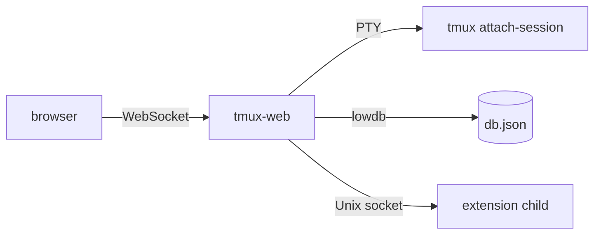

# Architecture

## Overview

## Components

- **Landing page** — Lists all active tmux sessions; clicking one opens a full terminal view powered by [ghostty-web](https://github.com/nickolay/ghostty-web).
- **Terminal** — The browser connects over WebSocket; the server spawns `tmux attach-session` via a PTY. Resize, input, and scrollback work; the client auto-reconnects if the connection drops.
- **Notes** — Per-session and global Markdown scratchpads persist to `~/.tmux-web/db.json` via lowdb (or `~/.dev/.tmux-web/db.json` in dev mode). See [Notes](notes.md).
- **Scheduler** — Queues `tmux send-keys` calls to fire after a delay and re-arms surviving tasks on restart. See [Scheduler](scheduler.md).
- **Extensions** — Sidebar plugins run as isolated child processes; the host reverse-proxies `/ext/<id>/api/*` to each extension over a Unix socket. See [Extensions](extensions.md) for install, config, and author guide.
